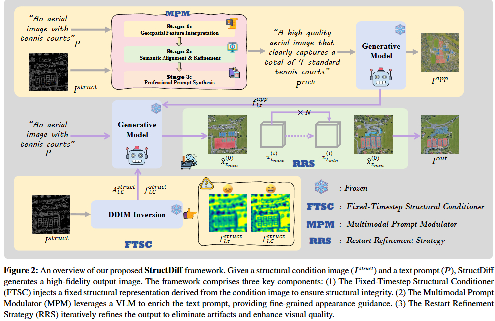

# StructDiff: A Training-Free Framework for Precise Structural Control in Remote Sensing Image Synthesis

Bingxuan Zhao, Chuang Yang, Qing zhou, Qi Wang




## Environment setup

After cloning this repository, run

```
conda env create -f environment.yml
conda activate StructDiff
```

## Example generation

For example image generation, run

```
python run.py
```

After that, in the directory `results` you will get the generated.

Image input format can be found in `configs/image_config.yaml`.

Model configurations can be found in `configs/model_config.yaml`. Note that the Appearance-Rich Prompting module is disabled in the default config. Please update the configurations if you would like to use other prompt models.

## Dataset

To create a stringent and domain-relevant benchmark for remote sensing (RS) imagery, our dataset is derived from the large-scale DIOR dataset [Li et al., 2020](https://arxiv.org/abs/1909.00133). The DIOR dataset is representative of real-world RS scenarios due to its multi-scale objects and complex geospatial layouts.

Using the `controlnet_aux` preprocessor, we extracted five distinct structural conditions from the DIOR images:
* Depth maps
* Canny edges
* HED edges
* Scribble drawings
* Lineart

These conditions were specifically chosen to cover a diverse spectrum of structural guidance, ranging from dense, pixel-wise constraints (like depth maps) to sparse, abstract line art (like lineart).

We curated 300 image-prompt pairs for each condition, resulting in a benchmark dataset of 1500 pairs.

### Data Split

To ensure an unbiased and challenging evaluation, this dataset was partitioned as follows:

* **Fine-tuning Set (90%):** Consists of 1350 pairs, allocated for training-based baseline models to allow them to adapt to the RS domain.
* **Test Set (10%):** Consists of the remaining 150 held-out pairs, used for the final evaluation of all methods.

This setup creates a fair yet challenging comparison, benchmarking our zero-shot method against specialist models that have been heavily optimized on in-domain data.


## Contact 

For any questions and discussions, please contact [Bingxuan Zhao](https://github.com/bxuanz) (bxuanzhao202@gmail.com).

## Acknowledgement

Our code is inspired by repositories including [Ctrl-X](https://github.com/genforce/ctrl-x), [Plug-and-Play](https://github.com/MichalGeyer/pnp-diffusers) and [Restart sampling](https://github.com/Newbeeer/diffusion_restart_sampling). We thank their contributors for sharing the valuable resources with the community.


